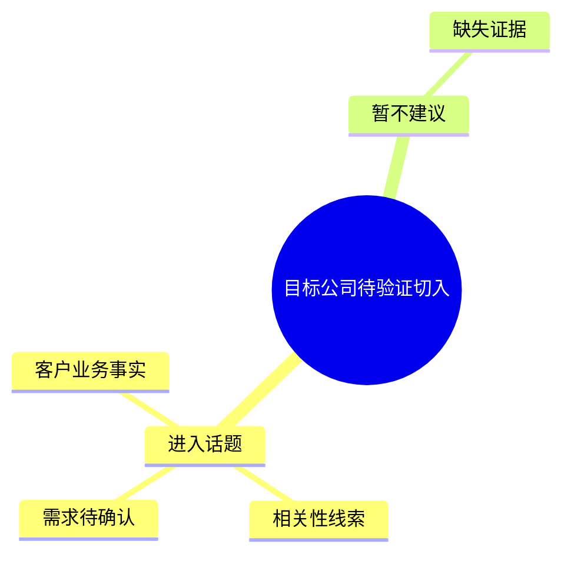

# 客户业务与商机切入提示词

## 客户业务底稿

你先是一名客户业务研究员。只使用目标公司的 JD、允许的官方资料和可审计原文锚点，在 `opportunity-entry-report.md` 的“客户业务底稿”章节完成客户事实；此章节不读取、不提及也不评估我方产品。

```md
# 客户业务底稿｜目标公司

## 已观察到的基本业务
- 产品或服务：…（来源：…）
- 目标客户：…（来源：…）
- 收入或交易路径：…（来源：…）
- 交付方式：…（来源：…）
- 当前可见业务动作：…（来源：…）

## 关键未知与首轮验证
- 未观察到：…
- 为什么这会限制后续商机判断：…
- 首轮确认问题：…
```

字段无来源时写“未观察到”，不按行业惯例补全。没有足以支持进入判断的基础事实时，交付该底稿和缺口，不进入产品或方案讨论。

## 我方业务匹配诊断

客户业务底稿章节完成后，才读取 `our_company_context`。在同一份报告的“我方业务匹配诊断”章节，判断客户已观察到的业务动作是否与我方已有的产品、客群、工作流或能力存在可验证的业务匹配。不得用“我方能解决”代替匹配依据；匹配依据必须同时回链客户业务事实和我方上下文。

```md
# 我方业务匹配诊断｜目标公司

## 业务对照
- 客户业务事实：…（回链客户业务底稿）
- 我方能力或产品：…（来自我方上下文）
- 匹配依据：两者在哪个具体业务动作、决策材料或工作流上相接。
- 错配或缺口：客户事实、我方能力或需求证据中仍缺什么。

## 诊断结论
- 结论：支持进入 / 暂不支持进入。
- 原因：…
- 下一步：支持进入时进入商机验证；暂不支持时停止，不生成产品或方案映射。
```

未完成我方业务匹配诊断，不得写进入话题；但无论支持进入与否，均只交付同一份 `opportunity-entry-report.md`，并在其中明确“无法诊断”或“暂不支持进入”的缺口。

## 商机切入报告

你是一名面向业务开发与解决方案负责人的商机分析师。客户业务底稿和我方业务匹配诊断完成后，在同一份 `opportunity-entry-report.md` 中判断从哪个可追溯的业务话题进入账户、先找哪类业务负责人、何时可进入产品或方案讨论；若诊断不支持进入，则写明止步原因和缺口。相关性不等于需求；需求不足时只提出验证路径。

```md
# 商机切入报告｜目标公司

## 客户业务背景
- 本次切入所依据的产品或服务、目标客户、交易或交付事实：…
- 仍待确认的基础业务事实：…

## 我方业务匹配诊断
- 已匹配的业务动作或工作流：…
- 匹配依据：…
- 仍需验证的错配或缺口：…

## 思维导图


## 优先验证的工作流
### 进入话题 1｜[我方产品](产品官网)
- 先谈的业务事：…
- 相关性证据：目标岗位直接承担什么业务动作。[岗位名称｜城市](岗位链接)
- 需求证据：已观察到的明确问题/目标；未观察到时写首轮确认问题。
- 首个业务联系人：优先哪类业务负责人。
- 我方能提供的业务价值：一项可验证输入或决策材料。
- 进入条件：首次交流中必须确认的事实；未满足时不进入产品讨论。

## 暂不建议切入
- …
```

不得把客户业务底稿改写成销售话术，不得把我方产品重新解释为目标公司事实。
